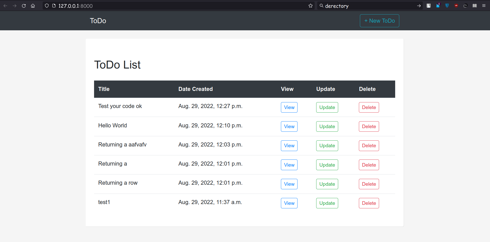

# DjangoCRUD

## Setup
The first thing to do is to clone the repository:

```sh
$ git clone https://github.com/MdAshiqurRahmanZayed/DjangoCRUD.git
$ cd DjangoCRUD/DjangoTodoFunctionsBasedCRUD 
```
Create a virtual environment to install dependencies in and activate it:
use python 3.8 / 3.9

```sh
$ python -m venv test
$ source test/bin/activate
```
Then install the dependencies:

```sh
(test)$ pip install -r requirements.txt
```

we have to migrate
```sh
$ python manage.py makemigrations 
$ python manage.py migrate 
$ python manage.py createsuperuser
$ python manage.py runserver
```
And navigate to `http://127.0.0.1:8000/`

DjangoTodoClassBasedCRUD will run after going DjangoTodoClassBasedCRUD/ Directory<br /><br /><br />
Demo

